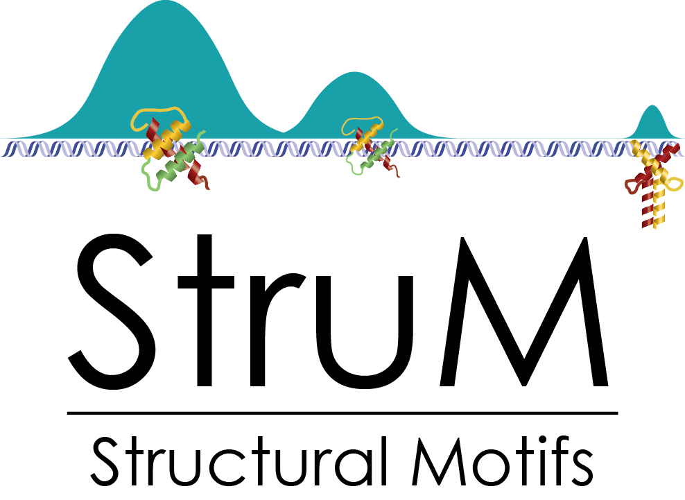

.. Structural Motifs documentation master file, created by
   sphinx-quickstart on Mon Jan 29 16:17:32 2018.
   You can adapt this file completely to your liking, but it should at least
   contain the root `toctree` directive.

========================================================================
StruMs: Structural Motifs documentation
========================================================================

Structural Motifs provide a way to represent DNA motifs based on the
shape of the DNA instead of the DNA sequence. These motifs may represent
the preferences driving specificity of transcription factors for their
binding sites. For more information about the underlying model of StruMs,
refer to :doc:`intro`.

The package described here provides a framework for computing and 
working with StruMs, based on DNA shape features from the `Dinucleotide
Property DataBase <http://diprodb.leibniz-fli.de/>`_. Currently 
available capabilities include:

* Train models from known binding sites
* Use expectation maximization to find *de novo* motifs
* Provide utility to incorporate additional quantitative features, 
  e.g. DNase hypersensitivity.
* Score matches of the motif to novel sequences

------------------------------------------------------------------------
Contents
------------------------------------------------------------------------

.. toctree::
   :maxdepth: 2

   intro
   installation
   examples
   code

========================================================================
Indices and tables
========================================================================

* :ref:`genindex`
* :ref:`modindex`
* :ref:`search`
